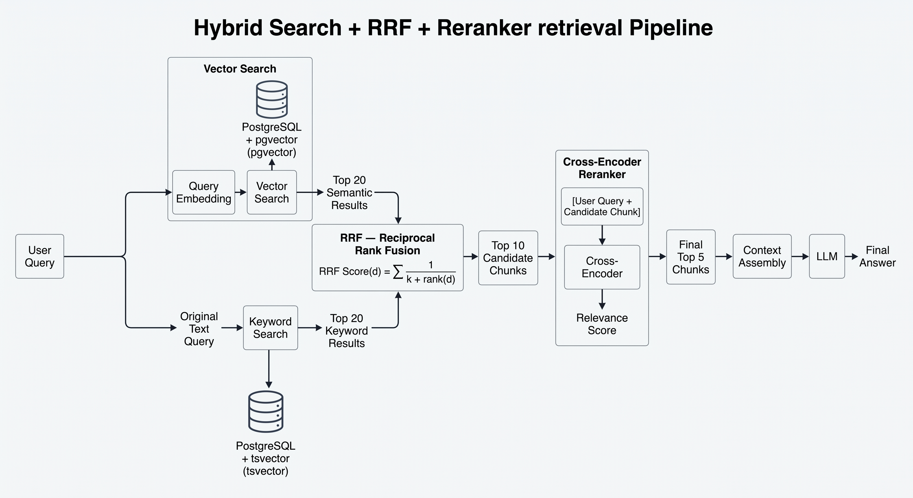

## Business Problem
A law firm or government authority in the Arab world needs a system that answers questions about Arabic legal documents — contracts, Egyptian Civil Code articles, Saudi regulations — accurately and with citations. Hallucinations are legally unacceptable.

## Data Pipeline

**Source.** The [Egyptian Civil Code PDF](https://sadanykhalifa.com/uploads/Laws/1576751803.pdf), a bilingual (Arabic/English) document where each page holds the articles side by side in two languages.

**Extraction.** I extracted the content from the PDF and converted each article into a structured record that follows the target schema below.


```json
{
  "article_number": 147,
  "book": "Obligations or Personal Rights",
  "chapter": "Sources of Obligations",
  "section": "Contracts",
  "topic": "The Effects of a Contract",
  "text_ar": "العقد شريعة المتعاقدين، فلا يجوز نقضه ولا تعديله ...",
  "text_en": "The contract makes the law of the parties. It can be revoked ...",
  "is_repealed": false,
  "source_page": 34,
  "citation": "Egyptian Civil Code, Article 147"
}
```

## Chunking Strategy

**Each article is one chunk.** Instead of splitting the text by a fixed number of tokens, every legal article becomes a single, self-contained `Document`. The system is **Arabic-only**: only the Arabic text is embedded.

## Retriever Architecture
 

## RAGAS Evaluation

The evaluation was conducted on a dataset of **20 samples**.The questions were generated using an LLM, while the `ground_truth` was taken verbatim from the database.

### Evaluation 

- **Faithfulness:** 90%
- **Context Recall:** 97%
- **Context Precision:** 99%

## Requirements

* Python 3.10+
* [uv](https://docs.astral.sh/uv/)

## Installation

### 1. Clone the repository

```bash
git clone <your-repository-url>
cd <your-project-directory>
```

### 2. Install dependencies

```bash
uv sync
```

This command will automatically:

* Create a virtual environment (`.venv`)
* Install the Python version required by the project
* Install all dependencies defined in `pyproject.toml`
* Use `uv.lock` to ensure reproducible dependency versions

### 3. Activate the virtual environment

On Linux / macOS:

```bash
source .venv/bin/activate
```

On Windows (PowerShell):

```powershell
.venv\Scripts\activate
```
### Setup the environment variables

```bash
$ cp .env.example .env
```
Set your environment variables in the `.env` file. Like `GEMINI_API_KEY` value.

### Run Alembic Migration

```bash
$ alembic upgrade head
```

## Run Docker Compose Services

```bash
$ cd docker
$ cp .env.example .env
```

- update `.env` with your credentials


```bash
$ cd docker
$ sudo docker compose up -d
```

## Access Services

* **FastAPI**: http://localhost:8000
* **Grafana**: http://localhost:3000
* **Prometheus**: http://localhost:9090

## Run the FastAPI Server (Development Mode)

From the project root directory:

```bash
uvicorn main:app --reload --host 0.0.0.0 --port 5000
```


 